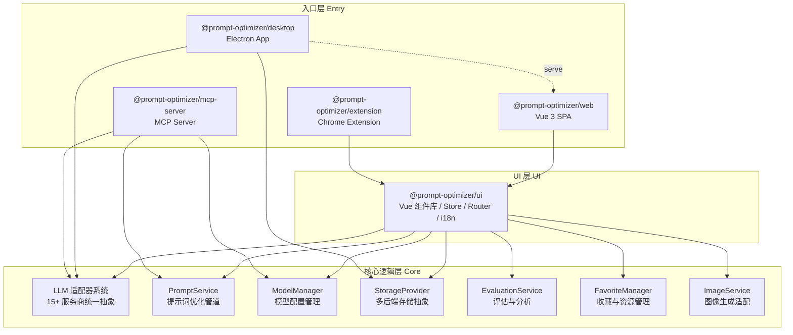
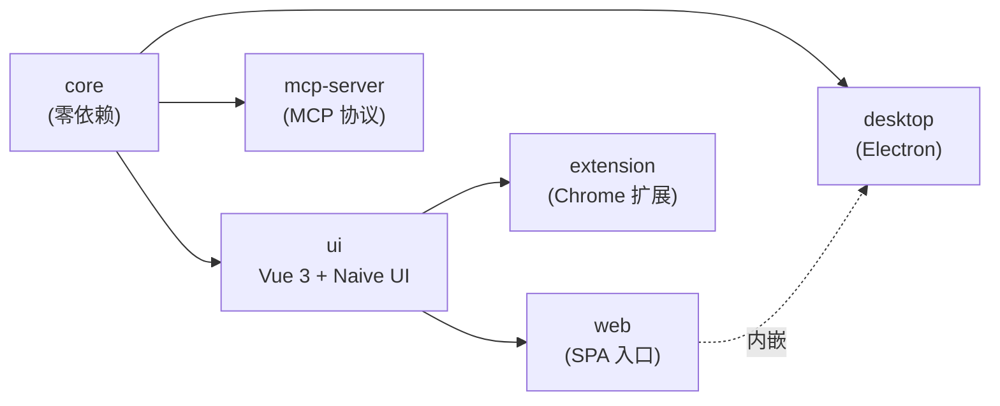

# Prompt Optimizer 技术架构文档

> **面向开发者的架构深度解析** — 适用于学习项目设计、二次开发与新功能贡献。

---

## 项目定位

Prompt Optimizer（提示词优化器）是一款**全平台 AI 提示词优化工具**，帮助用户编写、优化、测试和管理 AI 提示词。核心价值在于通过智能优化、变量管理、多轮测试等功能，将模糊的提示词想法转化为高质量、可复用的提示词资产。

- **GitHub**: [linshenkx/prompt-optimizer](https://github.com/linshenkx/prompt-optimizer)
- **许可证**: AGPL-3.0
- **当前版本**: v2.11.4

---

## 技术栈速览

| 层级 | 技术 | 说明 |
|------|------|------|
| 构建工具 | pnpm workspace + Vite + tsup | monorepo 管理，分别构建 CJS/ESM |
| 前端框架 | Vue 3 + TypeScript | Composition API，严格类型约束 |
| UI 组件库 | Naive UI | 企业级 Vue 3 组件库 |
| 状态管理 | Pinia | Vue 3 官方推荐状态管理 |
| 编辑器 | CodeMirror 6 | 代码/提示词编辑器 |
| 国际化 | vue-i18n | 三语支持 (zh-CN/zh-TW/en-US) |
| 本地存储 | Dexie.js (IndexedDB) | 浏览器端结构化数据存储 |
| LLM SDK | openai / @anthropic-ai/sdk / @google/genai | 多服务商统一抽象 |
| 桌面端 | Electron + electron-builder | 跨平台桌面应用，自动更新 |
| 测试 | Vitest + Playwright | 单元/集成/E2E 全覆盖 |
| 部署 | Docker / Vercel / Cloudflare Pages | 多方式部署 |
| 包管理 | pnpm 10.6.1 | workspace monorepo |
| 运行时 | Node.js ^22.0.0 | LTS 版本 |

---

## 代码规模

| 模块 | 源文件 | 代码量 | 职责 |
|------|-------|--------|------|
| `packages/core` | 290 个 `.ts` | ~1,688 KB | 核心逻辑：LLM 适配、提示词优化、存储、评估 |
| `packages/ui` | 357 个 `.ts/.vue` | ~4,319 KB | UI 组件库、Store、路由、i18n |
| `packages/web` | 少量入口 | 薄封装 | Web 应用入口，依赖 ui |
| `packages/extension` | 少量入口 | 薄封装 | Chrome 扩展入口，依赖 ui |
| `packages/desktop` | Electron 主进程 | 中等 | Electron 封装，依赖 core |
| `packages/mcp-server` | MCP 协议服务 | 中等 | MCP Server，依赖 core |
| `tests/e2e` | 41 个 `.ts` | ~280 KB | E2E 测试 |

> 核心逻辑层（core）的测试代码量达到源代码的 ~72%，测试覆盖率极高。

---

## 整体架构分层

### 分层原则

1. **core** — 纯逻辑，零 UI 依赖。可被任何 JavaScript 运行时（浏览器、Node.js、Electron）使用
2. **ui** — Vue 3 组件和状态管理，依赖 core。可被 web、extension 等入口复用
3. **entry (web/extension/desktop/mcp-server)** — 薄封装层，负责平台特定适配和启动逻辑

---

## 子包依赖关系

---

## 关键设计决策

### 1. 为什么用 pnpm monorepo？

- **代码共享**：core 层被 web、extension、desktop、mcp-server 四个入口复用
- **UI 复用**：ui 组件库被 web 和 extension 共享
- **统一构建**：通过 `scripts/run-many.js` 编排并行构建，保持包间构建顺序
- **版本同步**：根 `package.json` 的 `version` 字段驱动所有子包版本（`scripts/sync-versions.js`）

### 2. 为什么纯前端（无后端服务）？

- **隐私优先**：所有数据仅存储在浏览器本地（IndexedDB），不上传服务器
- **零运维成本**：静态文件部署即可，无需数据库、后端服务
- **离线可用**：桌面端和扩展端可完全离线工作
- **代价**：无云端同步、协作等高级功能

### 3. 为什么选择 IndexedDB（Dexie.js）？

- **容量**：浏览器存储上限可达数百 MB，远超 localStorage 的 5MB
- **结构化查询**：Dexie 提供类似 SQL 的查询 API，支持索引、事务
- **异步**：所有操作返回 Promise，不阻塞主线程
- **兼容性**：主流浏览器均支持，Electron 中也可用

### 4. 为什么不直接用 OpenAI SDK 而要做适配器抽象？

- **多服务商支持**：项目支持 15+ AI 服务商，每个 API 格式不同
- **扩展性**：新增服务商只需添加一个适配器类（~200 行代码）
- **参数映射**：不同服务商的参数名不同（如 `max_tokens` vs `maxOutputTokens`），适配器负责统一映射
- **流式处理差异**：SSE vs Stream 协议差异在适配器层消化

---

## 文档导航

| 章节 | 内容 | 适合读者 |
|------|------|---------|
| [LLM 适配器系统](./core-llm-adapter.md) | 三层抽象、15 个适配器实现、扩展指南 | 接入新 AI 服务商 |
| [核心服务层](./core-services.md) | PromptService、ModelManager、FavoriteManager 等 | 理解核心业务逻辑 |
| [存储层设计](./core-storage.md) | IndexedDB、文件存储、多后端抽象 | 理解数据持久化 |
| [UI 层架构](./ui-layer.md) | Vue 组件树、Store 设计、路由、i18n | 前端开发 |
| [数据流与请求链路](./data-flow.md) | 端到端请求链路、流式处理、变量替换 | 调试与问题排查 |
| [测试体系](./testing.md) | 三层测试金字塔、VCR 机制、E2E 隔离 | 测试编写 |
| [部署与构建](./deployment.md) | 构建流水线、Docker、Electron 打包 | 部署与发布 |
