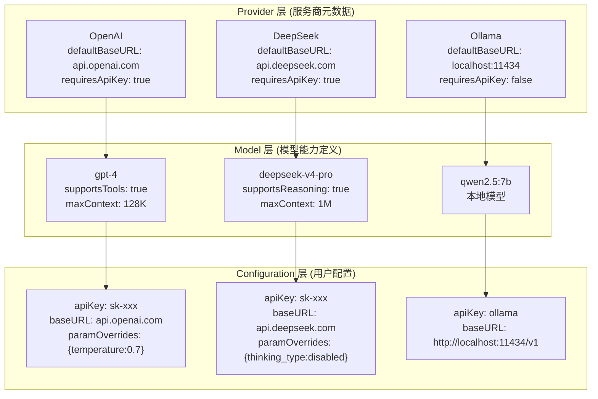
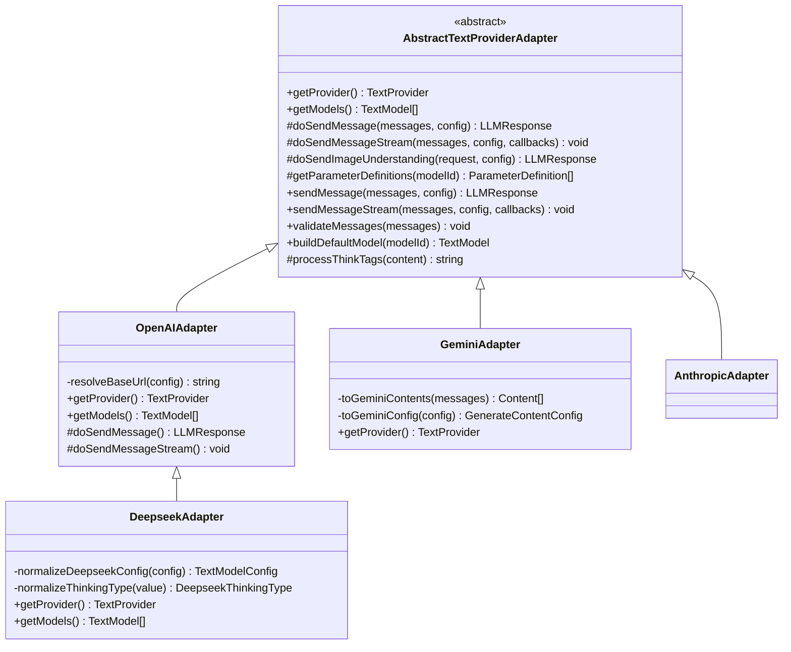

# LLM 适配器系统

> 项目最核心的架构设计 — 通过 Provider → Model → Configuration 三层分离 + 适配器模式，实现对 15+ AI 服务商的统一抽象。

---

## 三层分离模型



### 三层职责

| 层 | 来源 | 可变性 | 职责 |
|----|------|--------|------|
| **Provider** | 适配器硬编码 | 不可变 | 定义服务商标识、默认地址、连接参数 schema |
| **Model** | 适配器硬编码 + API 动态获取 | 不可变 | 定义模型能力（tool、reasoning、上下文长度）、参数 schema |
| **Configuration** | 用户输入 + 持久化 | 用户可编辑 | API Key、自定义 baseURL、模型参数覆盖值 |

---

## 适配器架构

### 抽象基类：AbstractTextProviderAdapter



**模板方法模式**核心：
- 基类定义 `sendMessage()` 模板方法（验证 → 规范化 → 调用子类实现 → 后处理）
- 子类只需实现 `doSendMessage()` 和 `doSendMessageStream()` 两个核心方法

```typescript
// 简化版模板方法流程
abstract class AbstractTextProviderAdapter {
  // 子类必须实现的抽象方法
  protected abstract doSendMessage(messages: Message[], config: TextModelConfig): Promise<LLMResponse>;
  protected abstract doSendMessageStream(messages: Message[], config: TextModelConfig, callbacks: StreamHandlers): Promise<void>;
  public abstract getProvider(): TextProvider;
  public abstract getModels(): TextModel[];

  // 模板方法：统一入口，封装验证和预处理
  public async sendMessage(messages: Message[], config: TextModelConfig): Promise<LLMResponse> {
    this.validateMessages(messages);       // 1. 验证消息格式
    this.validateConfig(config);            // 2. 验证配置
    const response = await this.doSendMessage(messages, config); // 3. 调用子类实现
    return this.processThinkTags(response); // 4. 后处理（如 <｜end▁of▁thinking｜> 标签）
  }
}
```

### 注册表模式：TextAdapterRegistry

```typescript
// 注册表在构造时注册所有适配器
class TextAdapterRegistry extends AbstractAdapterRegistry {
  protected initializeAdapters(): void {
    this.adapters.set("openai", new OpenAIAdapter());
    this.adapters.set("deepseek", new DeepseekAdapter());
    this.adapters.set("anthropic", new AnthropicAdapter());
    this.adapters.set("gemini", new GeminiAdapter());
    this.adapters.set("grok", new GrokAdapter());
    // ... 共 15 个适配器
    this.preloadStaticModels(); // 预加载静态模型缓存
  }

  // 根据 providerId 获取适配器
  getAdapter(providerId: string): ITextProviderAdapter {
    const adapter = this.adapters.get(providerId);
    if (!adapter) throw new RequestConfigError(`Unknown provider: ${providerId}`);
    return adapter;
  }
}
```

---

## 已支持的服务商与适配器

| 服务商 | Provider ID | 适配器类 | 代码量 | 继承自 | 特点 |
|--------|------------|----------|--------|--------|------|
| OpenAI | `openai` | OpenAIAdapter | 44 KB | 基类 | 功能最全，支持 Responses/Stream/Tools |
| Google Gemini | `gemini` | GeminiAdapter | 27 KB | 基类 | 自定义 SDK，图片理解 |
| Anthropic | `anthropic` | AnthropicAdapter | 25 KB | 基类 | 独立 SDK，Claude 系列 |
| DeepSeek | `deepseek` | DeepseekAdapter | 10 KB | OpenAIAdapter | thinking 参数映射 |
| Cloudflare | `cloudflare` | CloudflareAdapter | 10 KB | 基类 | Workers AI |
| Grok (xAI) | `grok` | GrokAdapter | 6 KB | 基类 | 文本+图像双模式 |
| 阿里百炼 | `dashscope` | DashScopeAdapter | 7 KB | 基类 | 通义系列 |
| Chrome Built-in | `chrome-built-in` | ChromeBuiltInAdapter | 5 KB | 基类 | 浏览器内置 AI |
| 智谱 AI | `zhipu` | ZhipuAdapter | 2 KB | OpenAIAdapter | GLM 系列 |
| MiniMax | `minimax` | MinimaxAdapter | 3 KB | 基类 | MiniMax 系列 |
| ModelScope | `modelscope` | ModelScopeAdapter | 3 KB | 基类 | 魔搭社区 |
| Ollama | `ollama` | OllamaAdapter | 2 KB | 基类 | 本地模型 |
| SiliconFlow | `siliconflow` | SiliconflowAdapter | 2 KB | OpenAIAdapter | 国产模型聚合 |
| OpenRouter | `openrouter` | OpenRouterAdapter | 2 KB | OpenAIAdapter | 模型聚合路由 |
| OpenAI 兼容 | `openai-compatible` | OpenAICompatibleAdapter | 1 KB | OpenAIAdapter | 通用兼容接口 |

> **设计观察**：DeepSeek、Zhipu、SiliconFlow 等国产服务商都继承了 `OpenAIAdapter`，因为它们遵循 OpenAI 兼容协议，只需覆盖 Provider 元数据和参数定义即可，代码量极低。

---

## 关键接口定义

### TextProvider — 服务商元数据

```typescript
interface TextProvider {
  readonly id: string;                    // 唯一标识，如 "openai"、"deepseek"
  readonly name: string;                  // 显示名称，如 "OpenAI"、"DeepSeek"
  readonly description?: string;
  readonly corsRestricted?: boolean;      // 浏览器端是否受 CORS 限制
  readonly requiresApiKey: boolean;       // 是否必须提供 API Key
  readonly defaultBaseURL: string;        // 默认 API 地址
  readonly supportsDynamicModels: boolean;// 是否支持动态获取模型列表
  readonly connectionSchema?: ConnectionSchema; // 连接参数结构
  readonly apiKeyUrl?: string;            // API Key 获取页面 URL
}

interface ConnectionSchema {
  required: string[];                     // 必填字段，如 ["apiKey"]
  optional: string[];                     // 可选字段，如 ["baseURL"]
  fieldTypes: Record<string, "string" | "number" | "boolean">;
}
```

### TextModel — 模型能力定义

```typescript
interface TextModel {
  readonly id: string;                    // 模型 ID，如 "gpt-4"、"deepseek-v4-pro"
  readonly name: string;                  // 显示名称
  readonly providerId: string;            // 所属服务商 ID
  readonly capabilities: {
    supportsTools: boolean;               // 是否支持 Function Calling
    supportsReasoning?: boolean;          // 是否支持推理（如 o1 系列）
    maxContextLength?: number;            // 最大上下文长度
  };
  readonly parameterDefinitions: readonly ParameterDefinition[]; // 参数定义
  readonly defaultParameterValues?: Record<string, unknown>;     // 默认参数
}
```

### TextModelConfig — 用户运行时配置

```typescript
interface TextModelConfig {
  providerMeta: { id: string; name: string };  // 服务商元数据
  modelMeta: { id: string; name: string };     // 模型元数据
  connectionConfig?: {
    apiKey?: string;
    baseURL?: string;
  };
  paramOverrides?: Record<string, unknown>;    // 参数覆盖（如 temperature）
  enabled: boolean;
  isLocal?: boolean;
}
```

---

## 扩展新服务商步骤（以 Grok 为例）

### 步骤 1：创建适配器类

```typescript
// packages/core/src/services/llm/adapters/grok-adapter.ts
export class GrokAdapter extends AbstractTextProviderAdapter {
  public getProvider(): TextProvider {
    return {
      id: "grok",
      name: "Grok",
      description: "xAI Grok models",
      requiresApiKey: true,
      defaultBaseURL: "https://api.x.ai",
      supportsDynamicModels: true,
      apiKeyUrl: "https://console.x.ai",
      connectionSchema: {
        required: ["apiKey"],
        optional: ["baseURL"],
        fieldTypes: { apiKey: "string", baseURL: "string" }
      }
    };
  }

  public getModels(): TextModel[] {
    return [
      {
        id: "grok-4-latest",
        name: "Grok 4 Latest",
        providerId: "grok",
        capabilities: { supportsTools: true, maxContextLength: 1000000 },
        parameterDefinitions: this.getParameterDefinitions("grok-4-latest"),
      }
    ];
  }

  protected async doSendMessage(messages, config): Promise<LLMResponse> {
    // 调用 xAI API
    const client = new OpenAI({ baseURL: config.connectionConfig.baseURL, apiKey: config.connectionConfig.apiKey });
    const response = await client.chat.completions.create({ model: config.modelMeta.id, messages });
    return { content: response.choices[0].message.content };
  }

  // ... doSendMessageStream, getParameterDefinitions 等
}
```

### 步骤 2：注册到 Registry

```typescript
// packages/core/src/services/llm/adapters/registry.ts
import { GrokAdapter } from "./grok-adapter";

// 在 initializeAdapters() 中添加：
const grokAdapter = new GrokAdapter();
this.adapters.set("grok", grokAdapter);
```

### 步骤 3：添加环境变量支持

在 `.env.local` 中添加：
```ini
VITE_GROK_API_KEY=your-xai-api-key-here
```

### 步骤 4：添加 i18n 翻译

在 `packages/ui/src/i18n/locales/zh-CN/models.ts` 中添加 Grok 相关文案。

---

## DeepSeek thinking 参数映射机制

DeepSeek 的 `thinking` 参数是一个特殊案例——它需要将用户友好的 `thinking_type` 参数映射为 API 所需的嵌套对象：

```typescript
// 用户看到的参数：thinking_type = "enabled" | "disabled"
// API 需要的格式：{ thinking: { type: "enabled" | "disabled" } }

private normalizeDeepseekParamOverrides(paramOverrides) {
  const { thinking_type, thinking, ...rest } = paramOverrides || {};

  const thinkingType = this.normalizeThinkingType(thinking_type)
    ?? this.extractExplicitThinkingType(thinking) // 兼容直接传 thinking 对象
    ?? "disabled";                                // 默认关闭

  return {
    ...rest,
    thinking: { type: thinkingType }
  };
}
```

这个设计体现了适配器层的核心价值：**消弭不同服务商 API 的差异，对上层暴露统一接口**。
