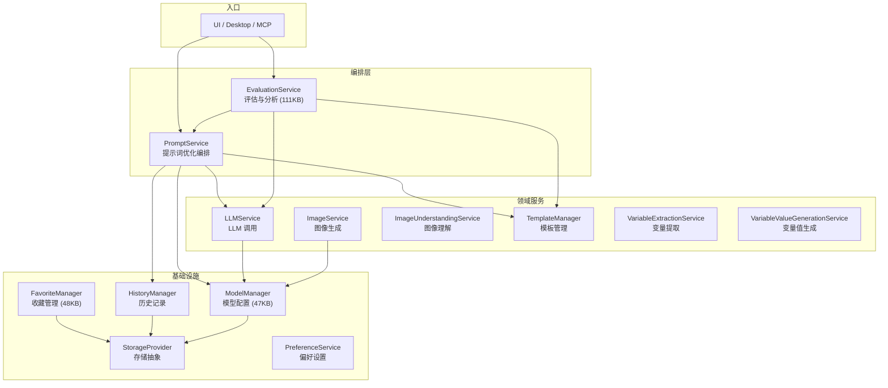
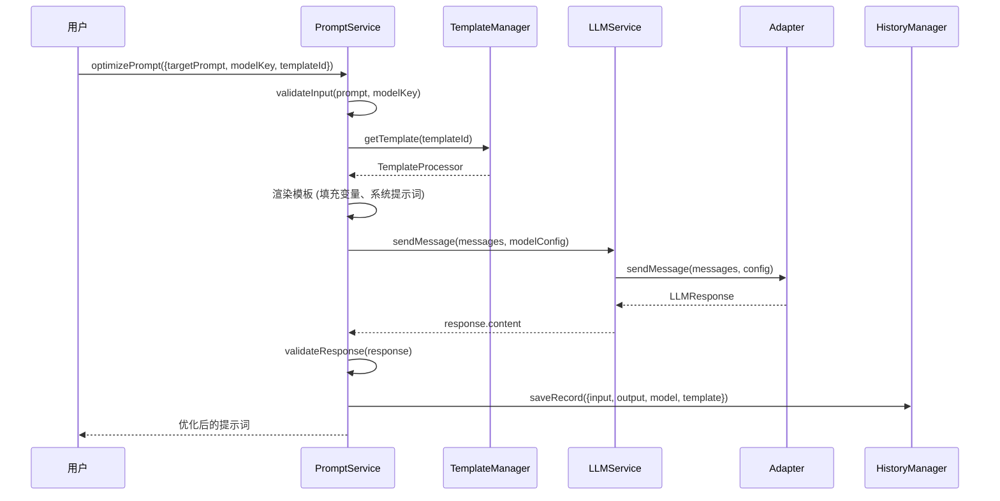

# 核心服务层

> core 包中的业务逻辑层，通过依赖注入模式组织，每个服务职责单一、边界清晰。

---

## 服务全景图



---

## PromptService — 提示词优化管道

文件：`packages/core/src/services/prompt/service.ts` (37KB)

### 依赖注入

```typescript
class PromptService implements IPromptService {
  constructor(
    private modelManager: IModelManager,         // 模型配置管理
    private llmService: ILLMService,              // LLM 调用
    private templateManager: ITemplateManager,    // 优化模板
    private historyManager: IHistoryManager,      // 历史记录
    private imageUnderstandingService?: IImageUnderstandingService  // 图片理解（可选）
  ) {}
}
```

### 核心方法

| 方法 | 功能 | 流程 |
|------|------|------|
| `optimizePrompt(request)` | 优化单条提示词 | 验证输入 → 加载模板 → 渲染上下文 → 调用 LLM → 验证响应 → 记录历史 |
| `optimizeMessage(request)` | 优化对话中的单条消息 | 同上，但针对多轮对话场景 |
| `iterateOptimization(request)` | 迭代优化（多轮） | 循环调用 optimizePrompt，每次将结果作为下一轮输入 |
| `testPrompt(request, callbacks?)` | 测试提示词效果 | 渲染变量 → 发送消息 → 流式返回结果 |
| `testConversation(request, callbacks?)` | 测试多轮对话 | 逐条发送消息，维持对话上下文 |

### 优化模板

系统内置 7 种优化模板（位于 `services/template/default-templates/`）：

| 模板 ID | 用途 | 适用模式 |
|---------|------|---------|
| `general-optimize` | 通用系统提示词优化 | Basic System |
| `user-optimize` | 用户提示词优化 | Basic User |
| `iterate` | 迭代优化 | 所有模式 |
| `evaluation` | 单条提示词评估 | 评估分析 |
| `evaluation-rewrite` | 基于评估结果改写 | 评估分析 |
| `evaluation-structured-compare` | 结构化对比评估 | 对比评估 |
| `image-optimize` | 图像生成提示词优化 | Image |

### 优化流程



---

## ModelManager — 模型配置管理

文件：`packages/core/src/services/model/manager.ts` (47KB)

### 职责

- 管理用户配置的模型实例（增删改查）
- 将适配器提供的 Provider + Model 元数据与用户配置合并
- 持久化模型配置到存储层
- 模型连接测试
- 处理模型导入/导出

### 关键子模块

| 文件 | 职责 |
|------|------|
| `converter.ts` (14KB) | 模型配置的序列化/反序列化，存储格式与运行时格式互转 |
| `defaults.ts` (8KB) | 默认模型配置、默认参数值 |
| `parameter-schema.ts` (3KB) | 统一参数定义 schema |
| `parameter-utils.ts` (11KB) | 参数 Merge、Override 拆分工具 |
| `validation.ts` (3KB) | 模型配置验证逻辑 |
| `metadata-resolver.ts` (2KB) | 从注册表解析 Provider/Model 元数据 |
| `advancedParameterDefinitions.ts` (7KB) | 高级参数定义（temperature、top_p 等） |

### 模型配置结构

```typescript
interface ModelConfig {
  id: string;                        // 持久化 ID (UUID)
  providerMeta: { id: string; name: string };
  modelMeta: { id: string; name: string };
  connectionConfig: {
    apiKey?: string;
    baseURL?: string;
  };
  paramOverrides?: Record<string, unknown>;
  enabled: boolean;                  // 是否启用
  isDefault?: boolean;               // 是否默认模型
  displayName?: string;              // 用户自定义名称
}
```

---

## FavoriteManager — 收藏管理

文件：`packages/core/src/services/favorite/manager.ts` (48KB)

### 职责

- 提示词收藏的 CRUD
- 资源包导出（含图片等媒体资源）
- 资源包导入（含去重校验）
- 版本历史管理
- 来源追踪（记录提示词从何处导入）
- 分类/标签管理

### 关键子模块

| 文件 | 职责 |
|------|------|
| `storage-guards.ts` (7KB) | 存储安全校验，防止损坏数据写入 |
| `type-converter.ts` (3KB) | 存储格式与运行时格式转换 |
| `type-mapper.ts` (5KB) | 类型映射 |

### 资源包结构

导出时生成包含所有引用资源的 ZIP 包：

```
favorite-export.zip
├── manifest.json         # 收藏列表元数据
├── prompts/
│   ├── prompt-1.json     # 提示词 + 参数 + 评估结果
│   └── prompt-2.json
└── assets/
    ├── image-1.png       # 引用的图片资源
    └── image-2.jpg
```

---

## EvaluationService — 评估与分析

文件：`packages/core/src/services/evaluation/service.ts` (111KB)

> ⚠️ 这是项目中最大的单文件，建议后续拆分

### 评估类型

| 评估类型 | 说明 | 模板 |
|---------|------|------|
| 单条评估 | 对单条提示词进行质量分析 | `evaluation` |
| 对比评估 | 两条提示词的效果对比打分 | `evaluation-structured-compare` |
| 改写评估 | 基于评估结果自动改写提示词 | `evaluation-rewrite` |

### 评估维度

- 清晰度 (Clarity)
- 完整性 (Completeness)
- 可操作性 (Actionability)
- 结构性 (Structure)
- 上下文利用 (Context Usage)
- 输出质量 (Output Quality)

---

## 服务间依赖注入关系

```typescript
// 服务初始化顺序（在 web/src/main.js 中）
const storageProvider = StorageFactory.create(runtimeEnv);
const modelManager = new ModelManager(storageProvider);
const historyManager = new HistoryManager(storageProvider);
const templateManager = new TemplateManager();
const llmService = new LLMService(modelManager);
const imageService = new ImageService(modelManager);
const promptService = new PromptService(modelManager, llmService, templateManager, historyManager);
const favoriteManager = new FavoriteManager(storageProvider);
const evaluationService = new EvaluationService(llmService, templateManager, promptService);
```

初始化顺序严格遵循依赖关系：存储 → 模型管理 → LLM 服务 → 提示词服务 → 评估服务。
