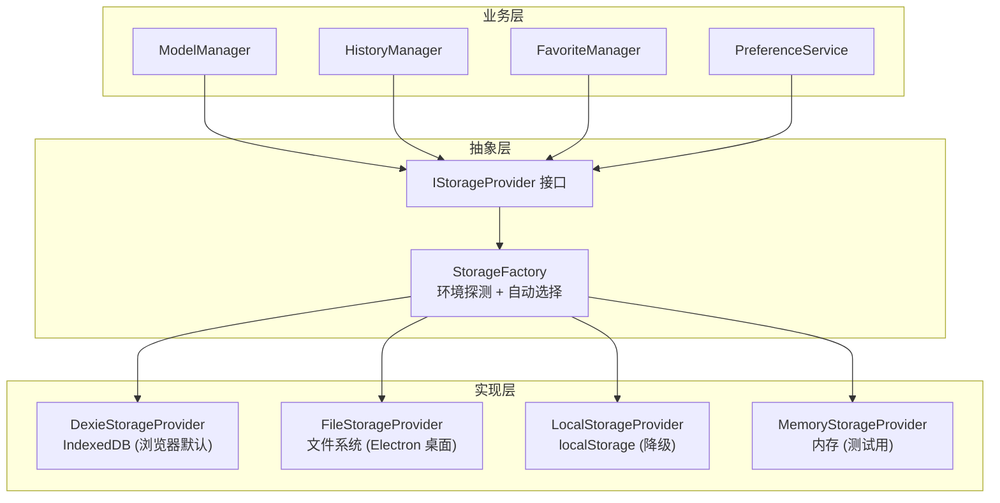

# 存储层设计

> 通过 IStorageProvider 接口抽象，支持 IndexedDB / 文件系统 / localStorage / 内存四种后端，运行时自动选择。

---

## 架构概览



---

## IStorageProvider 接口

```typescript
interface IStorageProvider {
  // 基础 CRUD
  get<T>(key: string): Promise<T | null>;
  set<T>(key: string, value: T): Promise<void>;
  delete(key: string): Promise<void>;
  clear(): Promise<void>;
  keys(): Promise<string[]>;

  // 批量操作
  getAll<T>(): Promise<Record<string, T>>;
  setAll<T>(entries: Record<string, T>): Promise<void>;

  // 元数据
  getType(): string;         // "dexie" | "file" | "localStorage" | "memory"
  getStorageInfo(): Promise<{ used: number; available: number }>;
}
```

---

## 四种实现对比

| 特性 | DexieStorageProvider | FileStorageProvider | LocalStorageProvider | MemoryStorageProvider |
|------|---------------------|--------------------|--------------------|--------------------|
| 存储介质 | IndexedDB | 文件系统 | localStorage | 内存 Map |
| 容量上限 | ~数百 MB | 硬盘容量 | ~5-10 MB | 内存容量 |
| 持久化 | ✅ 持久 | ✅ 持久 | ✅ 持久 | ❌ 进程结束丢失 |
| 结构化查询 | ✅ Dexie API | ❌ 序列化 JSON | ❌ 序列化 JSON | ❌ Map 查询 |
| 事务支持 | ✅ | ❌ | ❌ | ❌ |
| 运行环境 | 浏览器 / Electron | Electron 桌面端 | 浏览器降级 | 单元测试 |
| 适用场景 | 生产（Web/扩展） | 生产（桌面） | 降级方案 | 测试 |

---

## StorageFactory — 环境自动选择

```typescript
// packages/core/src/services/storage/factory.ts
class StorageFactory {
  static create(env: RuntimeEnvironment): IStorageProvider {
    switch (env) {
      case "electron":
        // 桌面端：优先文件存储，因为容量更大且不受浏览器限制
        return new FileStorageProvider(getAppDataPath());

      case "browser":
        // 浏览器端：优先 IndexedDB，不可用时降级到 localStorage
        try {
          return new DexieStorageProvider();
        } catch {
          console.warn("IndexedDB 不可用，降级到 localStorage");
          return new LocalStorageProvider();
        }

      case "test":
        // 测试环境：内存存储，快速且无副作用
        return new MemoryStorageProvider();

      default:
        return new DexieStorageProvider();
    }
  }
}
```

---

## DexieStorageProvider — IndexedDB 实现

文件：`packages/core/src/services/storage/dexieStorageProvider.ts` (12KB)

### 数据库 Schema

```typescript
class PromptOptimizerDB extends Dexie {
  // 键值对存储（通用）
  keyValuePairs!: Table<{ key: string; value: any }>;

  // 收藏提示词
  favorites!: Table<FavoriteRecord>;

  // 历史记录（优化/测试历史）
  history!: Table<HistoryRecord>;

  // 模型配置
  modelConfigs!: Table<ModelConfigRecord>;

  // 图像资产
  imageAssets!: Table<ImageAssetRecord>;

  // 分类
  categories!: Table<CategoryRecord>;

  // 标签
  tags!: Table<TagRecord>;

  // 偏好设置
  preferences!: Table<PreferenceRecord>;

  constructor() {
    super("PromptOptimizerDB");
    this.version(1).stores({
      keyValuePairs: "key",
      favorites: "id, categoryId, createdAt, updatedAt",
      history: "id, modelKey, createdAt",
      modelConfigs: "id, providerId, isDefault",
      imageAssets: "id, createdAt",
      categories: "id, parentId, order",
      tags: "id, name",
      preferences: "key",
    });
  }
}
```

### 索引策略

| 表 | 主键 | 索引 | 查询场景 |
|----|------|------|---------|
| favorites | `id` | `categoryId`, `createdAt`, `updatedAt` | 按分类筛选、按时间排序 |
| history | `id` | `modelKey`, `createdAt` | 按模型筛选历史 |
| modelConfigs | `id` | `providerId`, `isDefault` | 按服务商分组、查找默认模型 |
| categories | `id` | `parentId`, `order` | 构建分类树 |
| tags | `id` | `name` | 标签搜索/自动完成 |

---

## FileStorageProvider — 文件系统实现

文件：`packages/core/src/services/storage/fileStorageProvider.ts` (16KB)

### 存储路径

```
# Windows
%APPDATA%/PromptOptimizer/data/

# macOS
~/Library/Application Support/PromptOptimizer/data/

# Linux
~/.config/PromptOptimizer/data/
```

### 文件结构

```
data/
├── favorites.json          # 收藏列表
├── history.json            # 历史记录
├── model-configs.json      # 模型配置
├── preferences.json        # 偏好设置
├── categories.json         # 分类
├── tags.json               # 标签
├── key-value-pairs.json    # 通用键值对
└── image-assets/           # 图片资源目录
    ├── uuid-1.png
    └── uuid-2.jpg
```

---

## 启动安全检查（Startup Safety Check）

文件：`packages/core/src/services/storage/startup-safety-check.ts` (12KB)

在应用启动时执行的数据完整性检查：

1. **版本迁移检查**：检测存储格式版本，必要时执行迁移
2. **数据完整性校验**：检查关键表是否存在且可读
3. **损坏数据修复**：对轻微损坏的数据尝试自动修复（使用 jsonrepair 库）
4. **存储空间检查**：剩余空间不足时警告用户
5. **备份提示**：长时间未备份时提醒用户导出数据

```typescript
async function performStartupSafetyCheck(provider: IStorageProvider): Promise<SafetyCheckResult> {
  const checks: CheckResult[] = [];

  // 1. 存储可读性检查
  checks.push(await checkStorageReadable(provider));

  // 2. 关键表完整性
  checks.push(await checkKeyTables(provider));

  // 3. 数据格式验证
  checks.push(await validateDataFormat(provider));

  // 4. 存储空间检查
  checks.push(await checkStorageSpace(provider));

  // 5. 备份提醒
  checks.push(await checkBackupReminder(provider));

  return { passed: checks.every(c => c.ok), checks };
}
```

---

## 数据迁移策略

项目通过版本号管理存储格式变更：

```typescript
// storage-keys.ts
const STORAGE_VERSION_KEY = "storage_schema_version";
const CURRENT_SCHEMA_VERSION = 3;

// 版本迁移链
const migrations: Record<number, MigrationFn> = {
  1: migrateV1ToV2,  // 单文件 → 多文件拆分
  2: migrateV2ToV3,  // 添加 image-assets 表
};
```

每次读取数据时检查版本号，如不匹配则自动执行迁移。迁移前后均做快照备份，确保失败可回滚。
