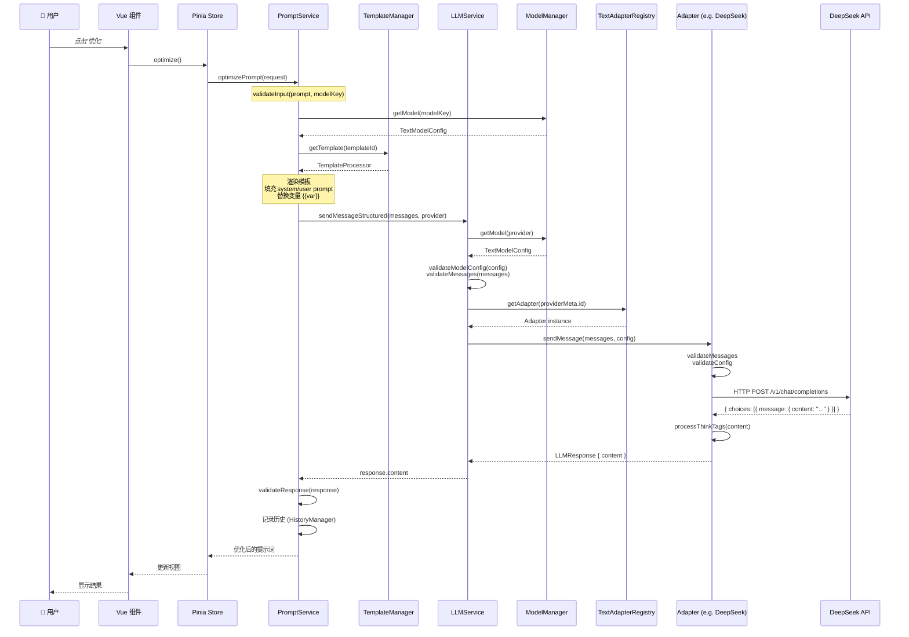
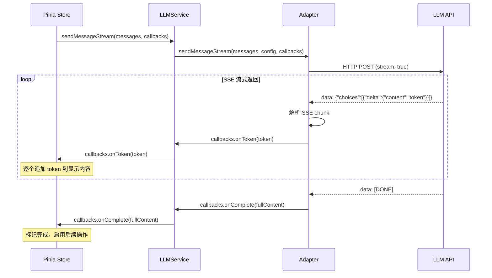
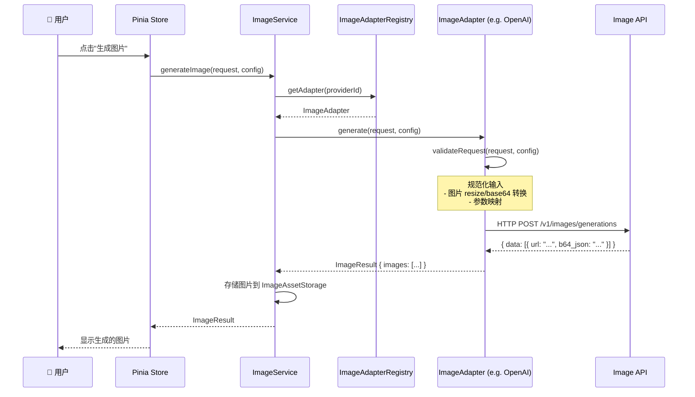
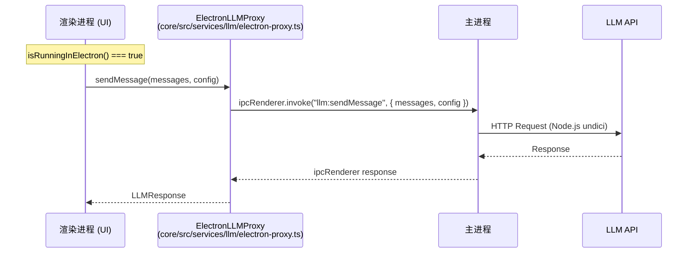
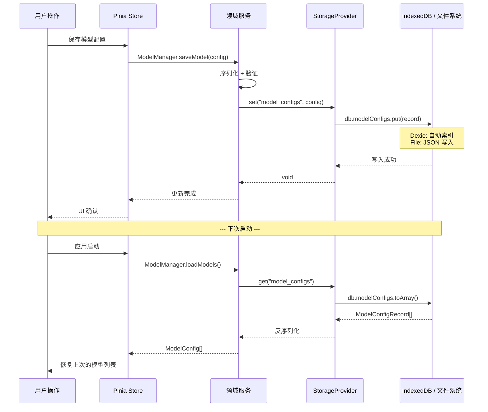

# 数据流与请求链路

> 从用户点击"优化"按钮到 LLM 返回结果的全链路追踪，涵盖文本/图像两种模式、流式响应、Electron 代理和变量替换。

---

## 文本优化全链路



---

## 流式响应处理



### StreamHandlers 接口

```typescript
interface StreamHandlers {
  onToken?: (token: string) => void;         // 每个 token 到达时
  onComplete?: (fullContent: string) => void; // 流结束
  onError?: (error: Error) => void;          // 错误处理
  onThinkingStart?: () => void;              // thinking 开始（DeepSeek/Grok）
  onThinkingToken?: (token: string) => void; // thinking token
  onThinkingEnd?: () => void;                // thinking 结束
}
```

---

## 图像生成链路



### 图像适配器继承结构

```
AbstractImageProviderAdapter (抽象基类)
  ├── OpenAIAdapter       (13KB)
  ├── SiliconflowAdapter  (14KB)
  ├── DashScopeAdapter    (13KB)
  ├── SeedreamAdapter     (12KB)
  ├── GrokAdapter         (11KB)
  ├── CloudflareAdapter   (8KB)
  ├── ModelScopeAdapter   (8KB)
  ├── OpenRouterAdapter   (8KB)
  ├── GeminiAdapter       (8KB)
  └── OllamaAdapter       (7KB)
```

---

## Electron 代理层

在桌面端，渲染进程不能直接发送 HTTP 请求（受 CORS/安全策略限制）。项目通过 IPC 机制将请求转发到主进程：



同样的代理模式也应用于：
- `ImageService` → `electron-proxy.ts`
- `PromptService` → `electron-proxy.ts`
- `FavoriteManager` → `electron-proxy.ts`
- `TemplateManager` → `electron-proxy.ts` (语言检测)
- `ModelManager` → `electron-proxy.ts` (配置读写)

### 代理选择逻辑

```typescript
// LLMService 中的判断
if (isRunningInElectron()) {
  const proxy = new ElectronLLMProxy();
  return proxy.sendMessage(messages, config);  // 走 IPC
} else {
  const adapter = registry.getAdapter(provider.id);
  return adapter.sendMessage(messages, config); // 直接请求
}
```

---

## 变量替换引擎

项目使用 **Mustache** 模板引擎处理提示词中的变量：

```
原始提示词：
"你是一个{{role}}，请用{{tone}}的语气回复用户关于{{topic}}的问题。"

变量值：
{ role: "技术顾问", tone: "专业", topic: "React 性能优化" }

渲染结果：
"你是一个技术顾问，请用专业的语气回复用户关于React 性能优化的问题。"
```

### Smart Fill（智能填充）

`packages/core/src/services/variable-value-generation/` 提供 AI 驱动的变量值自动生成：

```
用户输入："role=律师, 帮我生成 tone 和 topic 的值"
  → LLM 调用 → { tone: "严谨专业", topic: "合同纠纷", ... }
```

### 变量提取

`packages/core/src/services/variable-extraction/` 从提示词中自动识别 `{{variable}}` 模式并提取变量列表，用于构建变量配置界面。

---

## 前端数据持久化流程



持久化遵循 **写时序列化、读时反序列化** 原则，`ModelManager.converter` 模块负责存储格式与运行时格式互转。
