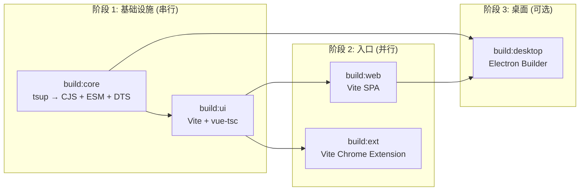
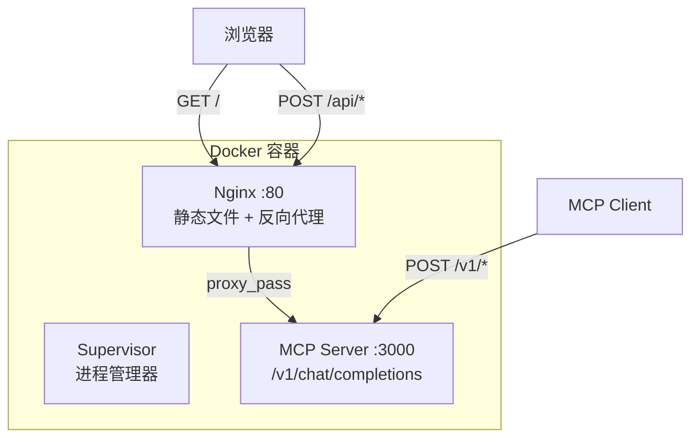
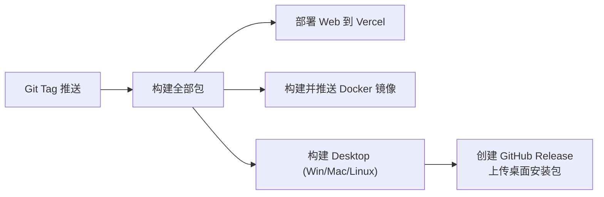

# 部署与构建

> 项目支持 5 种部署方式：在线 SaaS、Vercel、Cloudflare Pages、Docker、Desktop 安装包。

---

## pnpm Workspace 构建流水线

### 构建依赖图



### 构建脚本

```bash
# 完整构建（core → ui → web + ext 并行）
pnpm build
# → scripts/run-many.js build:core build:ui build:parallel
# → build:parallel → concurrently build:web build:ext

# 开发模式（core + ui + web dev server）
pnpm dev
# → clean:dist → build:core → build:ui → dev:parallel
# → concurrently "ui build --watch" "web dev"

# 桌面端构建
pnpm build:desktop
# → build:core → build:ui → build:web → build:desktop-only
# → electron-builder

# 仅桌面端（CI，跳过发布）
pnpm build:desktop:ci
# → build:core → build:ui → build:web → electron-builder --publish never
```

### run-many.js 编排器

`scripts/run-many.js` 是自定义的构建编排脚本，比 `pnpm -r` 更灵活：
- 支持串行依赖（`-s` 参数）
- 支持并行组（`--parallel` 参数）
- 自动处理构建顺序

---

## Vite 配置详解

文件：`packages/web/vite.config.ts`

```typescript
export default defineConfig(({ mode }) => {
  const monorepoRoot = resolve(__dirname, "../..");

  // envDir 指向 monorepo 根目录，加载根目录的 .env.local
  const env = loadEnv(mode, monorepoRoot);

  return {
    envDir: monorepoRoot,  // ⭐ 从项目根目录加载环境变量
    plugins: [vue()],
    server: {
      port: 18181,
      host: true,
      fs: { allow: [".."] },  // 允许访问上层目录的 workspace 依赖
      watch: {
        ignored: ["!**/node_modules/@prompt-optimizer/**"]  // 监听 workspace 包变化
      }
    },
    resolve: {
      preserveSymlinks: true,
      alias: {
        "@": resolve(__dirname, "src"),
        "@prompt-optimizer/core": path.resolve(__dirname, "../core"),
        "@prompt-optimizer/ui": path.resolve(__dirname, "../ui"),
        // ... 其他 workspace 包
      }
    },
    define: {
      // ⭐ 将 Vite 环境变量注入 process.env（兼容非 Vite 环境如 core 包）
      "process.env": {
        NODE_ENV: JSON.stringify(process.env.NODE_ENV || "development"),
        ...Object.keys(env).reduce((acc, key) => {
          acc[key] = env[key];
          return acc;
        }, {})
      }
    }
  };
});
```

### 关键设计点

1. **`envDir: monorepoRoot`**：环境变量从项目根目录加载，所有 workspace 包共享同一份 `.env.local`
2. **`define process.env`**：将 Vite 环境变量注入 `process.env`，使非 Vite 代码（core 包中）也能通过 `process.env.VITE_DEEPSEEK_API_KEY` 访问
3. **别名解析**：将 workspace 包名映射到本地路径，开发时直接引用源码，无需构建
4. **fs.allow**：允许 Vite dev server 访问上层目录，确保 workspace 依赖正常工作

---

## Docker 镜像构建

文件：`Dockerfile`

### Multi-stage Build

```dockerfile
# 阶段 1: 构建
FROM node:22-slim AS build
RUN npm install -g corepack@latest && corepack enable
COPY . /app
WORKDIR /app
RUN pnpm install --frozen-lockfile
RUN pnpm run build          # 构建 Web + 所有依赖
RUN pnpm mcp:build          # 构建 MCP Server

# 阶段 2: 运行
FROM node:22-alpine
RUN apk add --no-cache nginx apache2-utils dos2unix supervisor gettext curl

# 复制 Web 静态文件到 Nginx
COPY docker/nginx.conf /etc/nginx/http.d/default.conf
COPY --from=build /app/packages/web/dist /usr/share/nginx/html

# 复制 MCP Server
COPY --from=build /app/packages/mcp-server/dist /app/mcp-server/dist
COPY --from=build /app/packages /app/packages    # workspace 依赖
COPY --from=build /app/node_modules /app/node_modules

# 复制启动脚本
COPY docker/generate-config.sh /docker-entrypoint.d/
COPY docker/supervisord.conf /etc/supervisor/conf.d/
COPY docker/start-services.sh /start-services.sh

EXPOSE 80
CMD ["sh", "/start-services.sh"]
```

### 双进程架构



- **Nginx**：提供 Web 静态文件 + 反向代理 API 请求到 MCP Server
- **MCP Server**：Express 服务，处理 `/v1/chat/completions` 等 API 请求
- **Supervisor**：管理两个进程的生命周期

### Docker Compose

```yaml
# docker/docker-compose.yml
services:
  prompt-optimizer:
    image: linshen/prompt-optimizer:latest
    ports:
      - "8080:80"
    environment:
      - VITE_OPENAI_API_KEY=${VITE_OPENAI_API_KEY}
      - VITE_DEEPSEEK_API_KEY=${VITE_DEEPSEEK_API_KEY}
      # ... 其他 API Key
      - ACCESS_PASSWORD=${ACCESS_PASSWORD:-}    # 可选访问密码
    volumes:
      - ./data:/app/data                        # 数据持久化（可选）
```

---

## Electron 打包

文件：`packages/desktop/package.json` → `build` 字段

### electron-builder 配置

```json
{
  "build": {
    "appId": "com.promptoptimizer.desktop",
    "productName": "PromptOptimizer",
    "directories": { "output": "dist" },
    "publish": {
      "provider": "github",
      "owner": "linshenkx",
      "repo": "prompt-optimizer"
    },
    "win": {
      "target": ["nsis", "zip"],
      "artifactName": "${productName}-${version}-${os}-${arch}.${ext}"
    },
    "mac": {
      "target": [
        { "target": "dmg", "arch": ["x64", "arm64"] },
        { "target": "zip", "arch": ["x64", "arm64"] }
      ]
    },
    "linux": {
      "target": ["AppImage", "zip"]
    },
    "nsis": {
      "oneClick": false,
      "allowToChangeInstallationDirectory": true
    }
  }
}
```

### 构建产物

| 平台 | 格式 | 自动更新 |
|------|------|---------|
| Windows | `.exe` (NSIS 安装程序) + `.zip` | ✅ GitHub Releases |
| macOS | `.dmg` (x64/arm64) + `.zip` | ✅ GitHub Releases |
| Linux | `.AppImage` + `.zip` | ✅ GitHub Releases |

### 自动更新 (electron-updater)

桌面端使用 `electron-updater` 从 GitHub Releases 检查并下载更新：

```typescript
import { autoUpdater } from "electron-updater";

// 配置 GitHub 发布源
autoUpdater.setFeedURL({
  provider: "github",
  owner: "linshenkx",
  repo: "prompt-optimizer",
});

// 检查更新
autoUpdater.checkForUpdatesAndNotify();
```

---

## 部署方式对比

| 方式 | 命令/操作 | 适用场景 | 特点 |
|------|----------|---------|------|
| **在线版** | 直接访问 [prompt.always200.com](https://prompt.always200.com) | 零配置使用 | 纯前端，数据在浏览器本地 |
| **Vercel** | 点击 Deploy Button 或 Fork 导入 | 自行托管 | 支持 `ACCESS_PASSWORD` 密码保护 |
| **Cloudflare Pages** | Fork 后导入，构建目录 `packages/web/dist` | CF 生态用户 | 全球 CDN 加速 |
| **Docker** | `docker compose up` | 自建服务器 | Nginx + MCP Server 双进程 |
| **Desktop** | 下载安装程序 | 无 CORS 限制 | 自动更新，完全脱网可用 |

---

## MCP Server 独立构建

```bash
# 构建
pnpm mcp:build            # tsup src/index.ts src/start.ts --format cjs,esm

# 开发模式
pnpm mcp:dev              # node -r ./preload-env.js dist/start.js --transport=http

# 生产模式
pnpm mcp:start            # node -r ./preload-env.cjs dist/start.cjs --transport=http

# 测试
pnpm mcp:test             # vitest run
```

MCP Server 是一个独立的 Express HTTP 服务（默认端口 3000），提供与 LLM API 兼容的接口，可作为 Claude Desktop、Cursor 等 MCP 客户端的后端。

---

## GitHub Actions CI/CD

### 测试工作流 (`.github/workflows/test.yml`)
- 触发条件：PR 到 `main` 或 `develop`
- 运行 `pnpm test:gate`（仓库检查 + core 单元 + UI 单元）

### Release 工作流 (`.github/workflows/release.yml`)



### Docker 工作流 (`.github/workflows/docker.yml`)
- 触发条件：Release 发布
- 构建 multi-arch 镜像 (amd64 + arm64)
- 推送到 Docker Hub: `linshen/prompt-optimizer`
