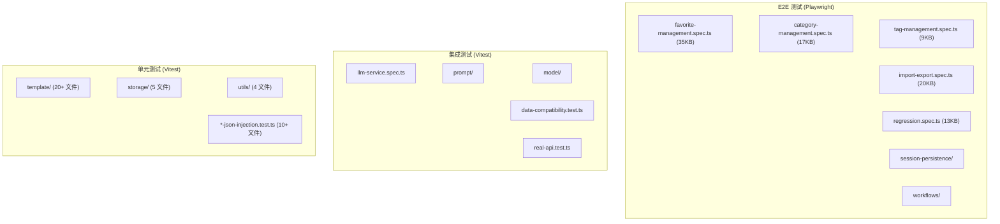
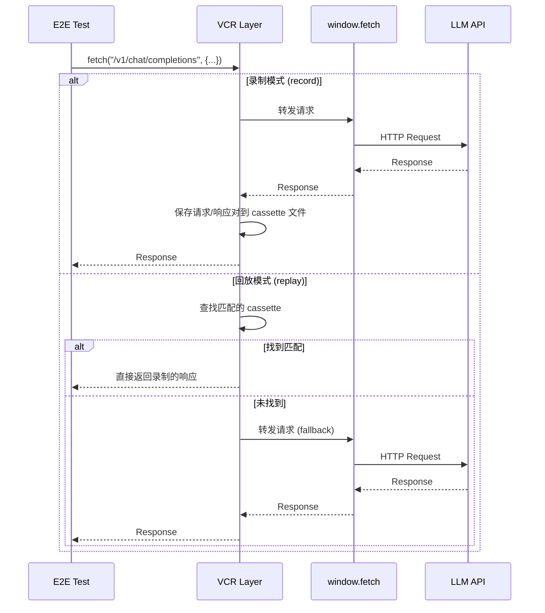

# 测试体系

> 项目拥有完善的测试金字塔：单元测试 (Vitest)、集成测试 (Vitest)、端到端测试 (Playwright)，core 层测试覆盖率约 72%。

---

## 三层测试金字塔



---

## 单元测试

### 测试框架：Vitest

```bash
# 运行所有单元测试
pnpm test:unit           # pnpm -r test --run --passWithNoTests

# 运行特定包测试
pnpm -F @prompt-optimizer/core test

# watch 模式
pnpm -F @prompt-optimizer/core test:watch
```

### 核心测试覆盖

#### 模板测试 (20+ 文件)

| 测试文件 | 覆盖内容 |
|---------|---------|
| `manager.test.ts` | 模板注册、加载、ID 一致性 |
| `processor.test.ts` | 模板渲染、变量填充 |
| `languageService.test.ts` | 模板语言服务 |
| `advanced-optimize.test.ts` | 高级优化模板行为 |
| `minimal.test.ts` | 最小化模板 |
| `soul-template-registration.test.ts` | 核心模板注册完整性 |
| `extension-environment.test.ts` | 扩展环境下的模板行为 |
| `context-types-*.test.ts` | 上下文类型管理器 |
| `evaluation-template-guardrails.test.ts` | 评估模板防护 |

#### JSON 注入防护测试 (10+ 文件)

这是项目测试中最有特色的部分 — 针对 LLM 输出 JSON 中可能出现的注入问题进行专项测试：

| 测试文件 | 测试场景 |
|---------|---------|
| `advanced-optimize-json-injection.test.ts` | 高级优化模板 JSON 注入 |
| `image-*-json-injection.test.ts` (5 个) | 图像优化模板 JSON 注入 |
| `image-json-structured-optimize-json-injection.test.ts` | 结构化图像优化 JSON 注入 |
| `iterate-json-injection.test.ts` | 迭代优化 JSON 注入 |
| `user-optimize-json-injection.test.ts` | 用户优化 JSON 注入 |
| `image-evaluation-prompt-only-json-injection.test.ts` | 图像评估 JSON 注入 |

#### 存储测试

| 测试文件 | 内容 |
|---------|------|
| `dexieStorageProvider.test.ts` | IndexedDB CRUD 操作 |
| `fileStorageProvider.test.ts` | 文件系统存储 |
| `localStorageProvider.test.ts` | localStorage 降级方案 |
| `memoryStorageProvider.test.ts` | 内存存储（测试用） |
| `startup-safety-check.test.ts` | 启动安全检查 |

---

## 集成测试

### LLM 服务集成测试

```typescript
// tests/integration/llm-service.spec.ts
describe("LLMService", () => {
  it("应该能通过 DeepSeek 适配器发送消息", async () => {
    const service = createLLMService();
    const response = await service.sendMessageStructured([
      { role: "user", content: "Hello" }
    ], "deepseek-v4-pro");
    expect(response.content).toBeTruthy();
  });
});
```

### 真实 API 测试

`tests/integration/real-api.test.ts` 和 `tests/helpers/real-llm.ts` 提供真实 API 调用测试：

```bash
# 需要设置环境变量后运行
RUN_REAL_API=1 pnpm -F @prompt-optimizer/core test:integration
```

这些测试默认被跳过（`it.skip`），仅在设置环境变量时运行，避免 CI 中依赖外部 API。

---

## E2E 测试 (Playwright)

### 自定义 Fixture

文件：`tests/e2e/fixtures.ts`

```typescript
// 每个测试独立 BrowserContext + 独立数据库名
export const test = base.extend({
  context: async ({ browser }, use) => {
    const context = await browser.newContext({ storageState: undefined });
    await use(context);
    await context.close();
  },

  page: async ({ context }, use, testInfo) => {
    const page = await context.newPage();

    // 为每个测试生成唯一的数据库名
    const testDbName = `test-db-${testInfo.workerIndex}-${Date.now()}-${Math.random()}`;

    // 通过 addInitScript 注入测试数据库名
    await page.addInitScript((dbName) => {
      try { localStorage.clear(); } catch {}
      try { sessionStorage.clear(); } catch {}
      (window as any).__TEST_DB_NAME__ = dbName;
    }, testDbName);

    // 控制台错误监控
    page.on("console", (msg) => { /* 收集错误 */ });
    page.on("pageerror", (error) => { /* 收集页面错误 */ });

    // VCR 设置
    await setupVCRForTest(page, testName, testCase);

    await use(page);
  }
});
```

### 数据库隔离策略

```
Test A → test-db-0-1716800000-abc123 → IndexedDB A
Test B → test-db-1-1716800001-def456 → IndexedDB B
Test C → test-db-0-1716800002-ghi789 → IndexedDB C
```

- 每个测试有唯一的数据库名，完全隔离
- 支持并行执行（多个 worker）
- 测试结束后数据库自动废弃（不清理也不影响其他测试）

### E2E 测试覆盖

| 测试文件 | 大小 | 覆盖场景 |
|---------|------|---------|
| `favorite-management.spec.ts` | 35KB | 收藏的增删改查、分类、排序、搜索 |
| `import-export.spec.ts` | 20KB | 资源包导入导出、跨版本兼容 |
| `category-management.spec.ts` | 17KB | 分类树操作、嵌套、拖拽排序 |
| `regression.spec.ts` | 13KB | 核心功能回归测试 |
| `tag-management.spec.ts` | 9KB | 标签管理、自动完成 |
| `tag-autocomplete.spec.ts` | 9KB | 标签输入自动补全 |
| `favorite-share-garden-live.spec.ts` | 9KB | Prompt Garden 集成 |
| `session-persistence/` | 目录 | 会话状态持久化 |
| `workflows/` | 目录 | 完整工作流测试 |

### E2E 运行方式

```bash
# 运行全部 E2E
pnpm test:e2e

# 智能 E2E（只运行受影响的测试）
pnpm test:e2e:smart

# 门禁测试（核心场景）
pnpm test:e2e:gate

# 扩展测试
pnpm test:e2e:extended

# 录制模式（录制 API 响应）
pnpm test:e2e:record

# 回放模式（使用录制的响应）
pnpm test:e2e:replay
```

---

## VCR 录制回放机制

解决 LLM API 测试的核心痛点：**测试依赖外部 API、调用成本高、响应不稳定**。

### 工作原理



### Cassette 文件格式

```json
// cassettes/deepseek/optimize-simple-prompt.json
{
  "request": {
    "url": "https://api.deepseek.com/v1/chat/completions",
    "method": "POST",
    "body": { "model": "deepseek-v4-pro", "messages": [...] }
  },
  "response": {
    "status": 200,
    "body": {
      "choices": [{ "message": { "content": "优化后的提示词..." } }]
    }
  }
}
```

---

## 测试门禁

```bash
# 代码仓库级测试
pnpm test:repo
# → 运行：locale 一致性检查、中文运行时检查、package scripts 测试

# 核心门禁（仓库 + core 单元 + UI 单元）
pnpm test:gate
# → run-many.js -s test:repo test:gate:core test:gate:ui

# 完整门禁（+ E2E 门禁）
pnpm test:gate:full
# → run-many.js -s test:gate test:gate:e2e
```

CI 工作流 (`.github/workflows/test.yml`) 在 PR 时自动运行 `test:gate`。
