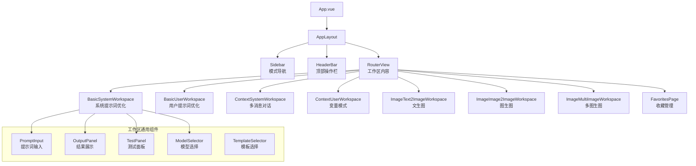
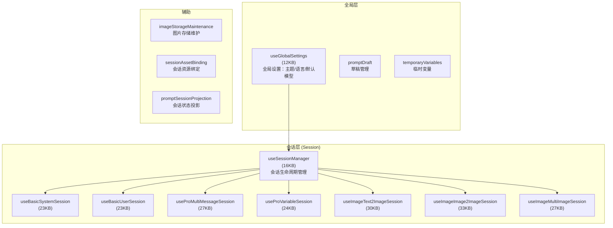

# UI 层架构

> 基于 Vue 3 + Naive UI + Pinia 构建的前端界面层，采用组件化 + Store 分离的架构模式。

---

## 组件树结构



### 组件分层

| 层级 | 目录 | 示例 | 职责 |
|------|------|------|------|
| **布局** | `components/app-layout/` | AppLayout, Sidebar, HeaderBar | 全局布局框架 |
| **工作区** | `components/basic-mode/`, `context-mode/`, `image-mode/` | BasicSystemWorkspace, ImageText2ImageWorkspace | 各功能模式的主工作区 |
| **通用** | `components/common/` | ModelSelector, PromptInput, OutputPanel | 可复用功能组件 |
| **领域** | `components/evaluation/`, `components/favorites/`, `components/variable/` | EvaluationPanel, FavoritesPage | 特定功能领域组件 |
| **基础** | `components/` 根目录 | ActionButton, ContentCard, DataManager | 原子组件 |

---

## Pinia Store 设计

### Store 分层



### Session Store 设计模式

每个工作区模式有独立的 session store，但遵循相同的结构模式：

```typescript
// 以 useBasicSystemSession 为例
export const useBasicSystemSession = defineStore("basicSystemSession", () => {
  // ===== 状态 =====
  const systemPrompt = ref("");           // 当前系统提示词
  const optimizedPrompt = ref("");        // 优化后结果
  const isOptimizing = ref(false);        // 优化中状态
  const testResults = ref<TestResult[]>([]);  // 测试结果

  // ===== 计算属性 =====
  const canOptimize = computed(() => systemPrompt.value.trim().length > 0);

  // ===== 方法 =====
  async function optimize() { /* 调用 PromptService.optimizePrompt */ }
  async function testPrompt() { /* 调用 PromptService.testPrompt */ }
  function reset() { /* 重置状态 */ }

  return { systemPrompt, optimizedPrompt, isOptimizing, canOptimize, optimize, testPrompt, reset };
});
```

> **注意**：6 个 Session Store（22-33KB）存在大量相似逻辑（优化/测试/重置流程），未来可考虑提取公共 composable 减少重复。

---

## 路由设计

文件：`packages/ui/src/router/index.ts`

```typescript
const routes: RouteRecordRaw[] = [
  // 根路由 → 启动引导（等待 globalSettings 恢复后决定初始工作区）
  { path: "/", name: "root", component: RootBootstrapRoute },

  // Basic 模式
  { path: "/basic/system", name: "basic-system", component: () => import("BasicSystemWorkspace") },
  { path: "/basic/user",   name: "basic-user",   component: () => import("BasicUserWorkspace") },

  // Pro 模式
  { path: "/pro/multi",    name: "pro-multi",    component: ContextSystemWorkspace },
  { path: "/pro/variable", name: "pro-variable", component: ContextUserWorkspace },

  // Image 模式
  { path: "/image/text2image",  name: "image-text2image",  component: () => import("ImageText2ImageWorkspace") },
  { path: "/image/image2image", name: "image-image2image", component: () => import("ImageImage2ImageWorkspace") },
  { path: "/image/multiimage",  name: "image-multiimage",  component: () => import("ImageMultiImageWorkspace") },

  // 收藏页
  { path: "/favorites", name: "favorites", component: () => import("FavoritesPage") },
];
```

### 关键设计点

1. **Hash 模式** (`createWebHashHistory`)：兼容 Electron（file:// 协议下 history 模式不可用）
2. **懒加载**：Image 模式和 Favorites 页使用动态 import，减少初始 bundle
3. **路由守卫** (`beforeEach → beforeRouteSwitch`)：切换工作区前保存草稿状态
4. **启动引导** (`RootBootstrapRoute`)：等待 `globalSettings` 从存储恢复后，根据上次使用的工作区自动跳转

### 工作区路由解析

```typescript
// workspaceRoutes.ts
const WORKSPACE_SUB_MODES = {
  basic: ["system", "user"],
  pro: ["multi", "variable"],
  image: ["text2image", "image2image", "multiimage"],
} as const;

// 路由路径解析：/basic/system → { mode: "basic", subMode: "system" }
parseWorkspaceRoutePath(path) → WorkspaceRouteInfo | null;
```

---

## 国际化方案

### 文件结构

```
i18n/locales/
├── en-US/
│   ├── core.ts       (14KB)  基础 UI 文案
│   ├── prompt.ts     (16KB)  提示词编辑区
│   ├── testing.ts    (30KB)  测试面板 ⭐ 最大模块
│   ├── context.ts    (24KB)  上下文/会话
│   ├── favorites.ts  (25KB)  收藏管理
│   ├── image.ts      (14KB)  图像模式
│   ├── models.ts     (17KB)  模型配置
│   ├── templates.ts  (6KB)   模板相关
│   ├── errors.ts     (7KB)   错误提示
│   └── index.ts              → 聚合导出
├── zh-CN/  (同上结构)
├── zh-TW/  (同上结构)
└── _legacy/
    ├── en-US.ts  (121KB)  旧版单文件格式
    ├── zh-CN.ts  (113KB)
    └── zh-TW.ts  (113KB)  → 经拆分后保留作兼容参考
```

### 使用方式

```typescript
// 在 Vue 组件中
import { useI18n } from "vue-i18n";
const { t } = useI18n();

// 使用分段 key
t("testing.runTest");          // "运行测试" / "Run Test"
t("models.provider.openai");   // "OpenAI"
t("errors.networkTimeout");    // "网络超时，请检查连接"
```

---

## Naive UI 组件使用

项目使用 Naive UI 作为 UI 组件库，主要使用的组件：

| 组件 | 用途 |
|------|------|
| `NConfigProvider` | 全局主题配置（暗色/亮色切换） |
| `NLayout`, `NLayoutSider`, `NLayoutContent` | 页面布局 |
| `NMenu` | 侧边栏模式导航 |
| `NSelect`, `NInput`, `NInputNumber` | 模型选择、参数配置 |
| `NButton`, `NButtonGroup` | 操作按钮 |
| `NModal`, `NDrawer` | 弹窗/抽屉 |
| `NTabs`, `NTabPane` | 标签页切换 |
| `NCard` | 内容卡片容器 |
| `NTag` | 标签显示 |
| `NDataTable` | 收藏列表、模型列表 |
| `NMessageProvider`, `useMessage` | 全局消息提示 |
| `NSpin` | 加载状态 |

### CodeMirror 6 编辑器集成

提示词输入区域使用 CodeMirror 6 作为代码编辑器：

- **核心包**：`@codemirror/view`, `@codemirror/state`, `@codemirror/language`
- **功能**：语法高亮、自动补全（`@codemirror/autocomplete`）、变量语法 `{{variable}}` 高亮
- **与 Naive UI 集成**：通过自定义组件包装 CodeMirror，适配 Naive 的主题变量

---

## 关键 UI 工具函数

| 文件 | 职责 |
|------|------|
| `favorite-resource-package.ts` | 收藏的 ZIP 打包/解包，含图片资源引用处理 |
| `favorite-reproducibility.ts` | 一键复现：从收藏加载完整工作区状态 |
| `favorite-asset-refs.ts` | 分析收藏引用的图片/资源 |
| `image-asset-storage.ts` | 图片的 IndexedDB 存储与 URL 生成 |
| `prompt-variables.ts` | Mustache 变量解析与渲染 |
| `history-source-binding.ts` | 历史记录的来源追踪 |
| `data-manager-resource-package.ts` | 数据管理的全量导出/导入 |
| `remote-backup.ts` | 远程备份（S3/WebDAV/Google Drive） |
| `evaluationVariableEvidence.ts` | 评估中的变量证据追踪 |
| `xml-renderer.ts` | XML 格式提示词的渲染（Image 模式使用） |
